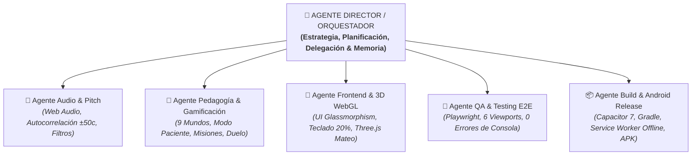

# 🎹 CONSTITUCIÓN MULTI-AGENTE — PIANOFÁCIL PRO

> **Sistema de Inteligencia y Coordinación de Desarrollo para PianoFácil PRO**  
> *Versión 9.1 PRO · Arquitectura Modular de 1 Director Orquestador y 5 Subagentes Especialistas*

---

## 🏛️ 1. Organigrama y Jerarquía de Agentes

---

## 📋 2. Catálogo de Agentes y Ámbitos de Dominio

### 👑 1. Agente Director / Orquestador (`director-orquestador`)
- **Rol:** Supervisor General, Estratega de Producto y Coordinador de Flujo.
- **Competencias:**
  - Triaje de requerimientos del usuario y diseño del plan de acción.
  - Delegación quirúrgica a los subagentes correspondientes.
  - Validación de coherencia global y actualización obligatoria de [PROYECTO_MEMORIA.md](file:///e:/Easy%20Piano/PROYECTO_MEMORIA.md).

### 🎵 2. Agente Audio & Pitch (`agente-audio-pitch`)
- **Rol:** Ingeniero de Sonido, DSP y Acústica.
- **Archivos bajo su dominio:** [js/audio.js](file:///e:/Easy%20Piano/js/audio.js), [js/pitch.js](file:///e:/Easy%20Piano/js/pitch.js).
- **Competencias:**
  - Síntesis aditiva de 6 armónicos + compresión dinámica para piano hiperrealista.
  - Algoritmo de autocorrelación en tiempo real con ventana de tolerancia exacta de `±50 cents` sin saltos de octava.
  - Manejo seguro de flujos de micrófono (`getUserMedia`, `micStarting`, desconexión de streams).
  - Grabadora de interpretaciones familiares.

### 🌱 3. Agente Pedagogía & Gamificación (`agente-pedagogia-gamificacion`)
- **Rol:** Diseñador Pedagógico Musical y Gamificación Infantil.
- **Archivos bajo su dominio:** [levels.js](file:///e:/Easy%20Piano/levels.js), [js/practice.js](file:///e:/Easy%20Piano/js/practice.js), [js/state.js](file:///e:/Easy%20Piano/js/state.js).
- **Competencias:**
  - Progresión estructurada de los 9 Mundos y 44 lecciones para Mateo (9 años).
  - "Modo Paciente" (cero reseteos de canción por fallos, tecla dorada guía con número de dedo).
  - Sistema de retos diarios ("Las Misiones de Mateo") con cofre de recompensas.
  - Temporizador de pausas inteligentes a los 15 minutos (cuidado de manos y vista).
  - Modo Duelo Familiar por turnos (*Mateo vs Fer*).

### 🎨 4. Agente Frontend & 3D WebGL (`agente-frontend-3d`)
- **Rol:** Diseñador de Interfaz, Experiencia de Usuario y Renderizado 3D.
- **Archivos bajo su dominio:** [index.html](file:///e:/Easy%20Piano/index.html), [styles.css](file:///e:/Easy%20Piano/styles.css), [js/piano.js](file:///e:/Easy%20Piano/js/piano.js), [js/avatar3d.js](file:///e:/Easy%20Piano/js/avatar3d.js).
- **Competencias:**
  - Sistema de diseño Glassmorphism oscuro con gradientes neón y oro.
  - Teclado acústico miniatura (~20% de altura de pantalla) con botones circulares de navegación de octavas.
  - Integración 100% local de Three.js con el avatar reactivo de Mateo y sus estados emocionales.
  - Adaptabilidad fluida a resoluciones móviles, tablets y desktop sin forzar orientación de pantalla.

### 🧪 5. Agente QA & Testing E2E (`agente-qa-testing`)
- **Rol:** Auditor de Calidad, Integridad y Automatización de Pruebas.
- **Archivos bajo su dominio:** [tests/audit_e2e_full.js](file:///e:/Easy%20Piano/tests/audit_e2e_full.js), [tests/test_mobile_responsive.js](file:///e:/Easy%20Piano/tests/test_mobile_responsive.js).
- **Competencias:**
  - Pruebas automatizadas en 6 viewports multidispositivo (100% libre de desbordes).
  - Suite Playwright de 11 tests E2E que validan audio, 3D, lecciones, persistencia y 0 errores de consola.
  - Verificación de no-regresión tras cada cambio del proyecto.

### 📦 6. Agente Build & Android Release (`agente-build-release`)
- **Rol:** DevOps, Empaquetado PWA Offline y Compilación Nativa.
- **Archivos bajo su dominio:** [scripts/sync_www.js](file:///e:/Easy%20Piano/scripts/sync_www.js), [sw.js](file:///e:/Easy%20Piano/sw.js), [manifest.webmanifest](file:///e:/Easy%20Piano/manifest.webmanifest), [package.json](file:///e:/Easy%20Piano/package.json), [android/](file:///e:/Easy%20Piano/android/).
- **Competencias:**
  - Sincronización limpia de recursos web hacia `www/`.
  - Service Worker (`sw.js` v10) con precaché total de Three.js y guías de manos para uso 100% offline.
  - Integración Capacitor 7 y compilación Gradle de [PianoFacil-Mateo.apk](file:///e:/Easy%20Piano/PianoFacil-Mateo.apk).

---

## 🔄 3. Protocolo de Ejecución de Tareas

1. **Recepción:** El Director evalúa la solicitud del usuario.
2. **Planificación:** Se selecciona al especialista correspondiente para redactar o ajustar el código.
3. **Validación:** El Agente QA ejecuta `npm run test:responsive` y `npm run test:audit`.
4. **Empaquetado:** El Agente Build ejecuta `npm run build:apk` si hubo cambios funcionales.
5. **Memoria:** El Director actualiza [PROYECTO_MEMORIA.md](file:///e:/Easy%20Piano/PROYECTO_MEMORIA.md) con la bitácora del cambio.
