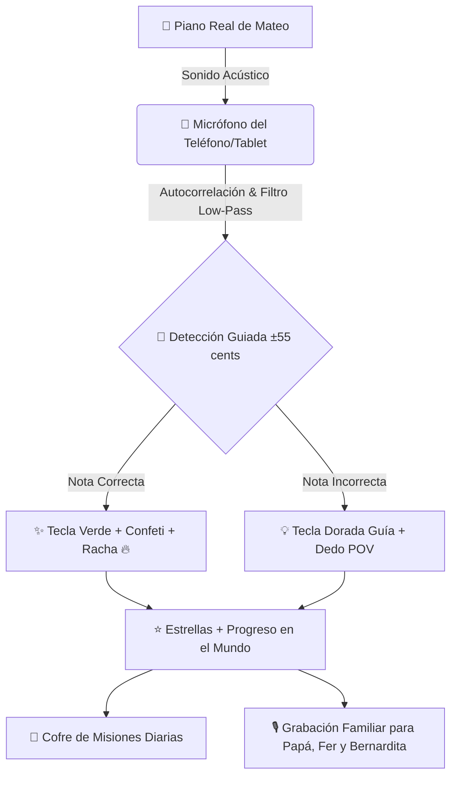
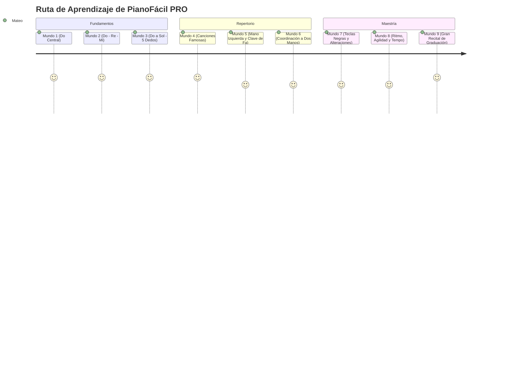
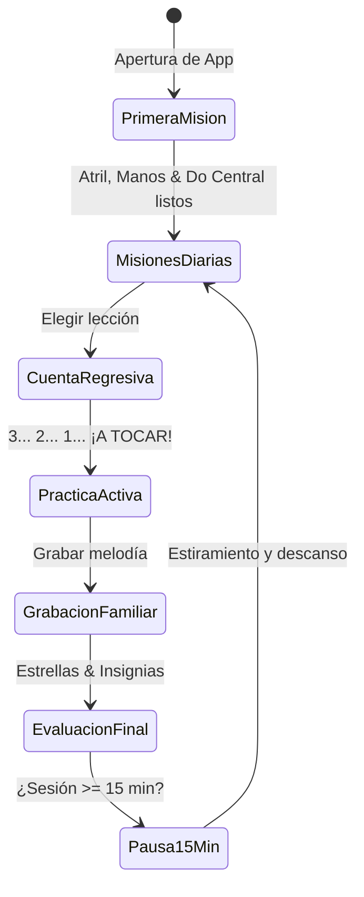

# 🎹 GUÍA INFOGRÁFICA & DOSSIER PEDAGÓGICO: PIANOFÁCIL PRO
> **El Curso de Piano Interactivo, Gamificado y Adaptativo de Mateo**  
> *Versión 9.0 PRO · Android APK Nativo (59.6 MB) · 100% Offline Local · Web Audio HI-FI*

---

## 🌟 1. Resumen Ejecutivo de la Aplicación

**PianoFácil PRO** es una aplicación diseñada específicamente para enseñar a un niño (**Mateo**) a tocar un **piano acústico o digital real**, fusionando:
1. **Detección acústica por micrófono en tiempo real** (sin necesidad de cables MIDI).
2. **Pedagogía positiva sin frustración** ("Modo Paciente" con pistas graduales y tecla dorada).
3. **Avatar 3D reactivo (Mateo)** renderizado en WebGL con expresiones emocionales y consejos de postura.
4. **Gamificación formativa:** 9 Mundos temáticos, 44 lecciones, insignias coleccionables, retos diarios ("Las Misiones de Mateo") y un grabador de canciones familiares para compartir con papá Seba, Fer y Bernardita.

---

## 🏛️ 2. Los 4 Pilares del Método Pedagógico

| Pilar | Descripción | Beneficio para Mateo |
| :--- | :--- | :--- |
| **🎤 Detección Guiada por Micrófono** | El motor de pitch valida la frecuencia fundamental esperada (`±55 cents`), ignorando armónicos y ruidos del ambiente. | Máxima confiabilidad al tocar el piano acústico sin falsos fallos. |
| **🐢 Modo Paciente (Cero Frustración)** | Se eliminaron las penalizaciones de reinicio (`restartFromStart`). Un error no interrumpe la música; solo ilumina la tecla correcta en dorado. | Aprendizaje positivo y fluido que fomenta la confianza. |
| **🎯 Las Misiones Diarias de Mateo** | 3 retos dinámicos al día: 🎵 Tocar 2 canciones, ⭐ Ganar 5 estrellas y ⏱ Practicar 5 minutos, con cofre de recompensas. | Crea el hábito diario de sentarse al piano con entusiasmo. |
| **🤖 Avatar 3D y Compañero Emocional** | Modelo 3D de Mateo renderizado con Three.js 100% local, con estados reactivos (*listo, feliz, fuego por racha, motivación y victoria*). | Acompañamiento empático y divertido durante toda la sesión. |

---

## 🗺️ 3. Mapa de Progresión: Los 9 Mundos y 44 Lecciones

### Detalle de los Mundos:

1. **🌱 Mundo 1: Primeros Pasos (Do Central - 4 Lecciones):**
   - Reconocer las 2 teclas negras, ubicar el Do 4 y pulsar con el dedo pulgar derecho.
2. **🌿 Mundo 2: El Trío Mágico (Do, Re, Mi - 5 Lecciones):**
   - Uso coordinado de los dedos 1, 2 y 3. Primeras melodías con saltos de notas.
3. **🖐 Mundo 3: La Mano Completa (Do a Sol - 5 Lecciones):**
   - Incorporación de los dedos 4 (anular) y 5 (meñique). Posición de mano redonda de maestro.
4. **⭐ Mundo 4: Mis Primeras Canciones Famosas (5 Lecciones):**
   - *Estrellita Dónde Estás*, *Oda a la Alegría* y *Campanita del Lugar*.
5. **🌊 Mundo 5: Explorando los Graves (5 Lecciones):**
   - Clave de Fa, notas graves con la mano izquierda (Do 3 a Sol 3) y digitaciones simétricas.
6. **👐 Mundo 6: Ambas Manos en Sincronía (5 Lecciones):**
   - Coordinación bimanual: la mano izquierda acompaña mientras la derecha canta la melodía.
7. **⚡ Mundo 7: El Misterio de las Teclas Negras (5 Lecciones):**
   - Sostenidos (#) y Bemoles (b), exploración de semitonos y nuevas sonoridades.
8. **🚀 Mundo 8: Ritmo y Agilidad (5 Lecciones):**
   - Práctica con metrónomo a diferentes velocidades (Lento, Normal, Rápido) y control de dinámica.
9. **👑 Mundo 9: El Gran Recital de Mateo (5 Lecciones):**
   - Obras completas de concierto, graduación con medalla de Oro y título de **Maestro de Piano**.

---

## 🔄 4. Flujo de una Sesión de Práctica Ideal

1. **🧭 Paso 1: "Primera Misión" (Mini-tutorial de 3 minutos):**
   - Cómo apoyar el teléfono/tablet frente al piano.
   - Postura ergonómica (espalda recta, manos en cúpula de burbuja).
   - Localización del Do 4 y prueba de micrófono en vivo.
2. **🎯 Paso 2: Revisar las Misiones del Día:**
   - Visualizar los objetivos pendientes en la barra superior (`🎯 Misiones 0/3`).
3. **⏱️ Paso 3: Cuenta Regresiva 3-2-1:**
   - La app reproduce la melodía de muestra y ofrece 3 segundos de preparación para colocar las manos.
4. **🎶 Paso 4: Tocar en el Piano Real:**
   - Seguir la tecla dorada, la flecha de guía y la digitación POV (1 al 5).
5. **🎙️ Paso 5: Grabación y Dedicatoria Familiar:**
   - Botón `🎙️ Grabar mi canción` para escuchar el resultado y compartirlo con su familia.
6. **🧘 Paso 6: Pausa Inteligente (A los 15 minutos):**
   - Sugerencia visual para estirar los dedos, relajar los hombros y descansar la vista.

---

## 🛡️ 5. Zona de Padres & Modo Duelo Musical

### 👨‍👩‍👧 Panel de Control Parental
- **Protección con PIN Aritmético:** Evita que el niño modifique ajustes sin querer (ej.: `4 × 3 = 12`).
- **Métricas de Aprendizaje:** Registro acumulado de minutos tocados, días en racha, estrellas totales y niveles completados.
- **Calibración Fina:** Ajuste manual de ganancia de micrófono (`x0.5` a `x6.0`) y selector de filtro de ruido ambiental.

### ⚔️ Modo Duelo Musical Familiar (*Mateo vs Fer*)
- Minijuego por turnos:
  - **Ronda 1:** Mateo toca una secuencia de 6 notas musicales.
  - **Ronda 2:** Fer o papá tocan la misma secuencia.
  - **Marcador en Vivo:** Comparación de precisión y tiempo, premiando al ganador con fanfarria triunfal y opción de revancha.

---

## ⚙️ 6. Ficha Técnica de Arquitectura

| Módulo | Archivos Fuente | Tecnología / Algoritmo |
| :--- | :--- | :--- |
| **Núcleo & Estado** | [js/state.js](file:///e:/Easy%20Piano/js/state.js), [levels.js](file:///e:/Easy%20Piano/levels.js) | LocalStorage JSON, Misiones Diarias, Puntuación, Insignias. |
| **Motor Web Audio** | [js/audio.js](file:///e:/Easy%20Piano/js/audio.js) | Web Audio API, 6 osciladores armónicos aditivos, DynamicsCompressor, MediaRecorder. |
| **Detección Pitch** | [js/pitch.js](file:///e:/Easy%20Piano/js/pitch.js) | Autocorrelación en tiempo real + Filtro Biquad Low-Pass 1400Hz + Ventana guiada `±55 cents`. |
| **Avatar 3D WebGL** | [js/avatar3d.js](file:///e:/Easy%20Piano/js/avatar3d.js), [assets/vendor/](file:///e:/Easy%20Piano/assets/vendor/) | Three.js r128 local, GLTFLoader, DracoLoader, OrbitControls, modelo `mateo.glb`. |
| **Teclado Proporcional** | [js/piano.js](file:///e:/Easy%20Piano/js/piano.js), [styles.css](file:///e:/Easy%20Piano/styles.css) | Teclado acústico de 37 teclas (MIDI 48-84), offsets negros, navegación con botones laterales circulares. |
| **Empaquetado Nativo** | [android/](file:///e:/Easy%20Piano/android/), [package.json](file:///e:/Easy%20Piano/package.json) | Capacitor 7, Gradle 8.11, OpenJDK 21, Android SDK 34 (`PianoFacil-Mateo.apk`). |
| **PWA & Offline** | [sw.js](file:///e:/Easy%20Piano/sw.js), [manifest.webmanifest](file:///e:/Easy%20Piano/manifest.webmanifest) | Service Worker v9 con precaché 100% local sin conexiones CDN. |

---

## 📄 7. Documento Listo para Visualizar e Imprimir a PDF

Se ha generado una versión interactiva HTML y CSS de altísima fidelidad lista para ver en el navegador o guardar en PDF:
👉 **[GUIA_INFOGRAFICA_PIANOFACIL_PRO.html](file:///e:/Easy%20Piano/GUIA_INFOGRAFICA_PIANOFACIL_PRO.html)**

*Para exportar a PDF desde Chrome, Edge o Firefox:*
1. Abre [GUIA_INFOGRAFICA_PIANOFACIL_PRO.html](file:///e:/Easy%20Piano/GUIA_INFOGRAFICA_PIANOFACIL_PRO.html) en tu navegador.
2. Presiona el botón dorado superior **"🖨️ Imprimir / Guardar en PDF"** (o `Ctrl + P`).
3. Selecciona **"Guardar como PDF"** y obtendrás un documento con tipografía premium y diseño limpio.
